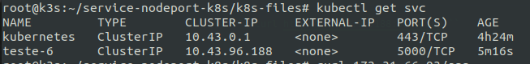

## Run application python with k3s using env and secret

### Install:
    - pip
    - python
    - docker
    - flask
    - k3s

### To run application python:
```python application.py```

### To run application python with Docker locally:
```docker build -t <user_docker_hub>/teste-6 .```

```docker run --rm -it -p 5000:5000 <user_docker_hub>/teste-6:latest```

### Open browser and access application
```http://0.0.0.0:5000/app``` 

### To push image docker to Docker Hub:
```docker login```

```docker push <user_docker_hub>/teste-6:latest```

### To run application python in Kubernetes (k3s):
```curl -sfL https://get.k3s.io | sh -```

### Enter in folder k8s-files and create my-secret.yml, deployment.yml and service.yml
```kubectl create -f my-secret.yml```

```kubectl create -f deployment.yml```

```kubectl create -f service.yml```

### You could run the commands next to verify if pod, deployment and service was running

- To verify pods was running:

```kubectl get po```

- To verify deployments was running:

```kubectl get deploy```

- To verify service was running:

```kubectl get svc```

- To print secret, run:
```kubectl get po```

```kubectl exec <pod_name> -- printenv MEU_TESTE```

- To verify secret inside pod, run:
```kubectl exec -ti <pod_name> -- sh```

- Inside pod, run to verify every secrets:
```set```

### Verify application running
```kubectl get svc```



- Get CLUSTER-IP ip teste-6 service

```curl http://<ip_service_teste6>:<port>/app```


